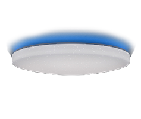

# Présentation

Ce plugin permet de gérer de nombreux bandeaux de leds ou ampoules leds ou prises électriques pilotés en wifi ou par radiofréquence 2.4 GHz via une box wifi vendue avec le produit.

    

# Compatibilités et limitations

## Produits compatibles
 
Il existe de nombreux produits compatibles avec le plugin mais de marques très différents ou sans marque.
 
Les produits compatibles :
-   Ampoules Mi.Light/EasyBulb/LimitlessLED : pas de retour d'état
-   Strip-led Mi.Light/EasyBulb/LimitlessLED : pas de retour d'état
-   Contrôleur led Mi.Light/EasyBulb/LimitlessLED V3.0 à V5.0 : pas de retour d'état
-   Contrôleur led Mi.Light/EasyBulb/LimitlessLED V6.0/iBox1/iBox2 : pas de retour d'état
-   Ampoules WiFi Xiaomi Yeelight blanches et couleur avec retour d'état
-   Strip-led WiFi Xiaomi Yeelight couleur avec retour d'état
-   Plafonnier WiFi Xiaomi Yeelight avec retour d'état
-   Lampe de bureau WiFi Xiaomi Mijia avec retour d'état

Produits pouvant être compatibles et non garantis :
-   LW12/Lagute : RGB strip-led controlleur : retour d'état
-   Wifi 320/370 RGB/RGBW strip-led controlleur : retour d’état partiel
-   Magic UFO : RGBW strip-led controlleur, gère le blanc
-   MagicHome : RGBW/RGBWW strip-led controlleur et ampoules/spots RGBW compatibles avec l'appli MagicHome
-   H801 : RGBW strip-led controlleur, pas de retour d’état
-   Arilux AL-C01/02/03/04/06/10 : RGB/RGBW/RGBWW strip-led controlleur, retour d’état
-   TP-Link LB100/110/120/130 : ampoules avec retour d’état
-   Lampe Extel Meli avec retour d'état
-   Xiaomi Philips : Lampe bureau, ampoule et plafonnier avec retour d'état
-   Ampoules compatibles Tuya Smart live ou Jinvoo smart ou eFamilyCloud apps avec retour d'état
-   Prises électriques compatibles Tuya Smart live ou Jinvoo smart ou eFamilyCloud apps avec retour d'état
-   Prises électriques TP-link HS100 HS110 avec retour d'état
-   Contrôleurs de pixel strip leds compatible Magic home avec retour d'état

Pour ces controlleurs, ampoules ou prises, le protocole d'échange ne provient pas directement du constructeur qui peut donc le modifier à tout moment. Plusieurs versions existent sur le marché qui ne sont pas toutes compatibles avec le plugin.

Produits incompatibles et qui ne le seront pas :
-   Les ampoules, prises ou contrôleurs de bandeau led qui contiennent un récepteur bluetoooth au lieu d'un recepteur radiofréquence 2.4 Ghz ou WiFi.
-   Les contrôleurs de bandeau led ou d'ampoules et les ampoules ou prises qui utilisent une connexion WiFi point à point avec l'application mobile.
-   La lampe de chevet Xiaomi n'est pas compatible (par construction).

## Test de compatibilité

Sur demande, un plugin de test peut être fourni.

Il est conseillé de se renseigner sur le forum pour connaitre la compatibilité d'un produit peu diffusé.

Aller sur le forum de Jeedom ici : <https://www.jeedom.com/forum/viewtopic.php?f=28&amp;t=24322>

# Limitations

Mi.Light/EasyBulb/LimitlessLED :
-   Toutes les fonctionnalités sont prises en compte par le plugin.

LW12/Lagute :
-   La programmation des modes custom n'est pas possible, il faut utiliser l'application fournie avec le contrôleur (Magic Home). Par contre, les modes customs peuvent être déclenchés avec le plugin.
-   Il existe plusieurs versions de LW12 qui peuvent ne pas être compatibles avec le plugin.

Magic UFO, MagicHome et Arilux AL-C01/02/03/04/06/10 :
-   La programmation des modes custom, le mode radio et les timers ne sont pas gérés. Il faut utiliser l'application fournie avec le contrôleur (Magic Home). Par contre, les modes customs peuvent être déclenchés avec le plugin.
-   Il existe différents modèles qui peuvent ne pas être compatibles avec le plugin.

Xiaomi Yeelight :
-   Les commandes HSV ne sont pas gérées. Flow et scène le sont en créant des commandes avec le code JSON correspondant à l'effet recherché (voir la documentation de l'API YeeLight).
-   La lampe de chevet Xiaomi n'est pas compatible.
-   La lampe de bureau Xiaomi Mijia est partiellement compatible (pas de retour d'état complet).

Wifi 320/370 :
-   Le retour d'état des modes scènes n'est pas géré, seul ON/OFF est géré.
-   Il existe différents modèles qui peuvent ne pas être compatibles avec le plugin.

H810 :
-   les jeux de scène ne sont pas gérés.
-   Il existe différents modèles qui peuvent ne pas être compatibles avec le plugin.

TP-Link :
-   Les timers ne sont pas gérés.
-   Les informations de consommation électrique ne sont pas gérées pour les ampoules.

Extel Meli :
-   La partie son de la lampe n'est pas prise en compte

Xiaomi Philips :
-   Toutes les fonctionnalités sont prises en compte

Ampoules ou prises compatibles Tuya Smart live ou Jinvoo smart ou eFamilyCloud apps:
-   Toutes les fonctionnalités sont prises en compte

Contrôleurs de pixel strip leds compatible Magic Home :
-   les scènes custom ne sont pas gérées.

# Configuration du module wifi

## Installer les leds

Télécharger l'application mobile du constructeur et suivre les indications afin de contrôler les leds avec le mobile. Pour chaque équipement wifilightV2, une aide détaillée est fournie dans la page de configuration.

Tant que la lampe n'est pas contrôlée avec l'application mobile, le plugin ne pourra pas fonctionner.

Consultez l'aide et les forums du constructeur des lampes.

## Configurer le routeur
Il faut configurer le DHCP de votre routeur (généralement fourni par votre fournisseur d'accès) pour modifier l'attribution de l'adresse IP du module wifi ou de l'ampoule ou la prise pour qu'elle soit statique. Noter cette adresse. En général, elle sera de la forme :
192.168.1.xxx 
où xxx correspond à l'adresse du module wifi (2 à 254)

Consultez les forums de votre box pour apprendre à configurer votre DHCP.

Après cette modification, vérifier que l'application mobile contrôle toujours les lampes.

Vous pouvez alors passer à la configuration du plugin wifilightV2.

## Installation et Configuration du plugin

Aide : 
-   Utiliser l'icône sous forme de point d'interrogation pour obtenir une aide sur chaque élément de configuration.

Paramétrage :
-   Pour paramétrer un équipement, choisir le menu Plugins / Objets communicants / wifilightV2
-   Puis cliquer sur le bouton en haut à gauche Ajouter un module Wifi 
-   Saisir le nom du module wifi
-   Saisir l'objet parent
-   Choisir la catégorie Lumière (par défaut)
-   Activer et rendre visible (par défaut)
-   Saisir l'adresse IP du module de la prise ou de l'ampoule WiFi (voir la FAQ pour plus d'explications)
-   Pour certains périphériques il est demandé de saisir le canal utilisé, créer un équipement wifilightV2 par canal
-   Pour certains périphériques il est demandé de saisir un jeton ou (et) un identifiant, consulter l'aide sur la page de configuration du périphérique
-   Pour certains contôleurs il faut indiquer le nombre de leds des pixel strip leds
-   Pour certains contrôleurs il faut indiquer l'ordre des couleurs si les couleurs par défaut ne correspondent pas
-   Saisir la marque ou la catégorie de la lampe, du strip-led ou du pont
-   Saisir le type exact du controlleur, de l'ampoule, de la prise ou du strip-led, ceci est indispensable pour créer les commandes afin de piloter le périphérique
-   Saisir le nombre d'envois de commandes : permet de répéter la commande pour un équipement éloigné en cas de mauvaise transmission. (1 par défaut). Certaines ampoules ou prises ne gèrent pas cette répétition car le plugin s'assure par retour d'état de la transmission. Certaines commandes relatives (incrémentations) ne sont pas répétées.
-   Saisir le délai d'envoi en cas de répétition (0 ms par défaut, 100 ms max)
-   Saisir le % d'incrémentaion de l'intensité lors de l'appui sur les boutons d'incrémentation ou de décrémentation de l'intensité lumineuse
-   Saisir le n° de groupe pour la synchronisation, voir plus bas

## Ajout des commandes
lors de la sauvegarde du module, les commandes sont automatiquement créées.

le nom des commandes peut être modifié. Les commandes automatiquement créées et effacées sont recréées lors d'une sauvegarde.

lorsque toutes les commandes sont créées, elles peuvent alourdir l'interface, il est possible de ne pas les afficher en configurant la commande.

## Modification de catégorie ou de modèle d'ampoule, de prise ou strip

-   supprimer toutes les commandes
-   modifier la catégorie ou le modèle
-   sauvegarder 2 fois

# Fonctionnement du retour d'état et état de connexion

## Compatibilité du retour d'état

Le retour d'état fonctionne avec les contrôleurs LW12/Lagute, Magic UFO, Arilux et Wifi 3x0 (partiellement) ainsi que les ampoules et bandeau led Xiaomi YeeLight, les ampoules et prises TP-Link, les ampoules Xiaomi Philips, les ampoules et prises compatibles Tuya smart app, Extel Meli et les contrôleurs de de pixel strip leds compatibles Magic Home.

## Principe

Le retour d'état consiste à ce que Jeedom récupère l'état du contrôleur si son état a été changé par un autre maitre que Jeedom : appli portable ou télécommande.

## Mise à jour périodique de Jeedom
LW12/Lagute, Magic UFO, Arilux, Wifi 3x0, TP-Link, Extel Meli, Xiaomi Yeelight, Xiaomi Philips, Tuya/Jinvoo/eFamillyCloud apps et contrôleurs de pixel leds compatibles magic home : toutes les minutes Jeedom interroge le contrôleur, la prise ou l'ampoule pour connaitre son état et mettre à jour l'allure des widgets du plugin ( sliders et couleur ). Des informations correspondant à l'état sont mises à jour et peuvent être interrogées par les scénarios.

## Mise à jour par scénario

Les commandes xxxxGet et Etat peuvent être utilisées dans un scénario Jeedom.

## Information de connexion :

La commande ConnectedGet permet de récupérer l'état de la connexion de chaque périphérique. Elle est mise à jour toutes les minutes.
-  1 : périphérique avec retour d'état OK
-  2 : impossible de préparer la connexion au périphérique
-  3 : périphérique non connecté
-  4 : pas de réponse du périphérique
-  5 : mauvaise réponse du périphérique
-  6 : périphérique sans retour d'état

# Fonctionnement de la synchronisation

##  Principe de la synchronisation

Il est possible de synchroniser plusieurs ampoules ou prises de marques différentes :

Toutes les ampoules ou prises qui ont le même numéro de groupe sont synchronisées

Le groupe 0 n'est pas synchronisé (groupe par défaut)

Lors de l'utilisation d'une commande d'une ampoule ou d'une prise du groupe, la même commande est appliquée sur toutes les ampoules du même groupe

Si la commande n'existe pas pour l'ampoule ou la prise synchronisée, elle est simplement ignorée.

Attention, les lampes ne vont pas être commandées exactement en même temps à cause des délais de latence lors de l'envoi des commandes qui se fait les uns après les autres.

## Configuration de la synchronisation

Il suffit de mettre un nombre différent de zéro dans le champ groupe lors de la configuration de l'équipement. Tous les équipements ayant les même numéros seront synchronisés.

# Cas particulier des box Mi.Light

## Configuration de l'iBox 1 ou 2

Depuis la version 1.0.58 des iBox 1 et 2, il est indispensable de modifier leur configuration pour qu'elles puissent dialoguer avec Jeedom. 

Se connecter en http (avec un navigateur Web) à l'adresse IP de votre iBox. Les identifiants par defaut sont admin/admin. Aller dans l'onglet "Other Setting" et dans "Network Parameters setting/Protocol" choisir UDP et sauvegarder.

# Cas particulier des Xiaomi Yeelight

## Configuration de l'ampoule
Il est indispensable d'activer le contrôle par réseau local via l'application  Xiaomi Yeelight.

## Mode Scène Xiaomi Yeelight
Il est possible de configurer les modes scène. Plusieurs modes scène sont préprogrammés dans le plugin mais il est possible d'ajouter d'autres modes scène.

Il suffit de respecter certaines conditions :
-   Ajouter une commande wifilightV2 action de type Défaut
-   Lui donner un nom (par exemple Scene Clignote)
-   Dans parametres, mettre la commande scène Yeelight, par exemple : "id":1, "method":"set_scene","params":["cf",0,0,"500,1,255,100,1000,1,16776960,70"]

Ne pas mettre les accolades de début et de fin ainsi que les caractères de retour à la ligne, le plugin les ajoutera automatiquement
S'inspirer des commandes préconfigurées pour créer ces modes scène supplémentaires.

## Mise à jour de l'état de la lampe dans Jeedom
Lors de l'activation du plugin et dès que le démon est lancé ainsi que toutes les 5 minutes, le plugin recherche les ampoules alimentées et connectées à Jeedom.

Dès que l'ampoule est trouvée, l'état de l'ampoule est remonté au plugin immédiatement.

Noter que le plugin peut mettre jusqu'à 5 minutes pour trouver une ampoule .

# Cas particulier des Xiaomi Philips

## Configuration de l'ampoule

Il est indispensable de récupérer un jeton (token) permettant au plugin de dialoguer avec les périphériques Xiaomi Philips.

La procédure est complexe et nécessite plusieurs manipulations. Faire une recherche sur le web avec comme mot clé : Xiaomi token.

Aucune aide ne sera donnée pour récupérer le jeton.

# Cas particulier des ampoules et prises compatibles Tuya/Smart live/Jinvoo/eFamillyCloud apps

## Configuration de l'ampoule ou de la prise

Il est indispensable de récupérer une clé locale (LocalKey) et un identifiant permettant au plugin de dialoguer avec ces ampoules ou ces prises.

La procédure est complexe et nécessite plusieurs manipulations. Faire une recherche sur le web avec comme mot clé : Tuya localkey, sur Github en particulier.

L'ampoule ou la prise ne doivent pas être connectées à une application sur téléphone, sinon elles ne répondront pas aux ordres de Jeedom. Il faut donc fermer toute application possiblement connectée avec l'ampoule ou la prise.

Si l'ampoule ou la prise est désinstallé puis réinstallé dans l'applciation mobile, alors sa clé sera modifiée. Il faudra rétrouver la clé avec la procédure ci-dessus. 
Aucune aide ne sera donnée pour récupérer la clé ou l'identifiant.

# FAQ

## Quelles ampoules ou prise peuvent être utilisées ?

lire la documentation

## Rien ne se passe

Faire d'abord fonctionner les lampes avec l'application mobile fournie par le constructeur.

Utiliser le bouton <tester> dans le menu Plugin/Objets Connectés/wifilightV2/commandes.

Aucune aide ne sera apportée sans que les lampes soient opérationnelles avec l'application constructeur des lampes sur un téléphone portable.
Il est nécessaire de donner une adresse IP fixe au controlleur ou à la lampe.

## Je ne sais pas configurer ma box internet

Aucune aide ne sera apportée sur la box et les notions nécessaires pour configurer le routeur pour attribuer une adresse IP fixe. Consulter les forums de la box.

## Toutes les commandes ne sont pas créées lors d'un changement de modèle d'ampoule ou de prise

Sauvegarder 2 fois.

## La gestion de l'intensité des ampoules blanches  Mi.Light/EasyBulb/LimitlessLED n'est pas pratique

Le constructeur des leds n'a pas prévu de pouvoir affecter directement l'intensité de l'ampoule. On ne peut qu'incrémenter ou décrémenter par rapport à la valeur précédente. Le plugin ne fait que reproduire ce fonctionnement. Le curseur qui est proposé est en conséquence capricieux.

## La gestion de l'intensité de la couleur a quelquefois des comportements imprévus

Aucun protocole ne gère l'intensité de la couleur, bien que généralement, les applications mobiles le fassent. Tant que Jeedom gère couleur et intensité, tout se passe bien. Mais si l'intensité est modifiée par une applciation mobile, les résultats ne sont pas toujours ceux attendus. Le plugin essaye de corriger le souci quand la lampe ou le controlleur possède un retour d'état.

## Y-a-t-il un retour d'état ?

Lire la documentation

## Impossible de faire fonctionner les ampoules Xiaomi Yeelight

Il est indispensable d'activer le mode contrôle par réseau local via l'application  Xiaomi Yeelight.

## Je ne contrôle pas le son des ampoules Extel Meli

Le son n'est pas géré par le plugin

## Impossible de faire fonctionner les ampoules Xiaomi Philips

Pour dialoguer avec les ampoules Xiaomi Philips, il est nécessaire de transmettre un jeton ou token en anglais. Sans ce jeton, l'ampoule ne prendra pas en compte les ordres qui lui sont envoyés. Ce jeton se trouve dans l'application Mi-Home et, selon votre téléphone, il existe plusieurs méthodes pour récupérer le jeton. La procédure est décrite sur plusieurs sites mais elle n'est pas reproduite ici pour deux raisons principales :

-   Xiaomi a déjà modifié son protocole ce qui a obligé à modifier la procédure pour récupérer le jeton, il pourrait encore le faire.
-   De nouvelle procédures plus simples peuvent être mises à disposition des internautes.
-   Cette documentation ne sera pas maintenue aussi rapidement qu'une simple recherche sur le web avec les mots clés : xiaomi token .

## Impossible de faire fonctionner les ampoules ou prises compatibles Tuya/Smart live/Jinvoo/eFamillyCloud apps

Pour dialoguer avec ces ampoules et prises, il est nécessaire de transmettre une clé locale ou Localkey ou token en anglais et un identifiant. Sans ces paramètres, l'ampoule ne prendra pas en compte les ordres qui lui sont envoyés. Il existe plusieurs méthodes pour récupérer ces informations. La procédure est décrite sur plusieurs sites mais elle n'est pas reproduite ici pour deux raisons principales :

-   Les applications ont été mises à jour, ce qui a obligé à modifier la procédure pour récupérer les informations.
-   De nouvelle procédures plus simples peuvent être mises à disposition des internautes.
-   Cette documentation ne sera pas maintenue aussi rapidement qu'une simple recherche sur le web avec les mots clés : Tuya LocalKey et en particulier sur Github.

# Comment obtenir de l'aide ?
Aller sur le forum de Jeedom ici : <https://forum.jeedom.fr/viewtopic.php?f=28&amp;t=2840>

# Difficultés

Erreur lors de l'envoi de commande / roue crantée sans arrêt / Emission sans arrêt

-   les équipements wifilightV2 doivent être mis à jour
-   aller dans chaque équipement et sauvegarder 2 fois
-   tester avec un nouvel équipement si cela persiste

Pont Mi.Light IBox1, iBox2, V6 : commande prise en compte aléatoirement
-   les ordres sont envoyés trop rapidement
-   dans les scénarios, mettre des pauses du durée suffisante

Pont Mi.Light IBox1, iBox2, V6 : commande non prise en compte
-   lors de l'appairage avec l'application Mi.Light sur mobile et lors de la configuration de wifilightV2, bien choisir la même télécommande.

LW12 Magic UFO Arilux Wifi3x0 H801 Contrôleurs compatibles Magic Home Tuya/Jinvoo/eFamillyCloud
-   de nombreuses versions existents et certaines peuvent être incompatibles avec le plugin. Contacter l'auteur pour une éventuelle mise à jour.

Des commandes sont manquantes lors de la création ou de la modification du sous type d'ampoule
-   sauvegarder l'équipement (2 fois)

